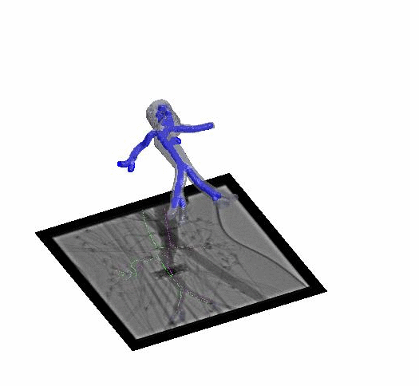

# Path_planning_for_FEVAR
3D path planning via deformable registration of abdominal aortic aneurysm for robot-assisted fenestrated endovascular repair

*Code for [Towards 3d path planning from a single 2d fluoroscopic image for robot assisted fenestrated endovascular aortic repair]([https://doi.org/10.1038/s41422-022-00727-6](https://ieeexplore.ieee.org/abstract/document/8793918))




## Requirement
<b>Version</b>: Matlab R2016a to R2017a<br />
<b>Platform</b>: Windows, Linux

## Script 'demo_2D3Dregist.m':
This demostrates how to recover a 3D skeleton for the robotic path from a 2D intra-operative segmented aneurysm shape and a 3D pre-operative skeleton.It will import a 2D jpg image of pre-operative fluoroscopy, a 2D segmentation label, and a 3D skeleton. It will display the time cost for registration of 2D/3D skeletons, the intra-operative (ground truth) skeleton, pre-operative skeleton and our prediction, as well as the evaluated distance errors in 2D and 3D.

## Folder 'function':
It includes all the codes written for the deformable registration between 2D and 3D skeleton.
* Please kindly read the license in each file.

## Folder 'data':
It includes the imported data used in demonstration.

## Folder 'external':
It includes redistributed codes used in the demonstration.
* Please kindly read the license in each file.

# For the citation
* For any academic publication using the codes in this folder, please kindly cite:<br />
  J. Q. Zheng, X. Y. Zhou, C. Riga and G. Z. Yang, "3D Path Planning from a Single 2D Fluoroscopic Image for Robot Assisted Fenestrated   Endovascular Aortic Repair", IEEE International Conference on Robotics and Automation (ICRA), 2019.
```bibtex
@inproceedings{zheng2019towards,
  title={Towards 3d path planning from a single 2d fluoroscopic image for robot assisted fenestrated endovascular aortic repair},
  author={Zheng, Jian-Qing and Zhou, Xiao-Yun and Riga, Celia and Yang, Guang-Zhong},
  booktitle={2019 International Conference on Robotics and Automation (ICRA)},
  pages={8747--8753},
  year={2019},
  organization={IEEE}
}
```
